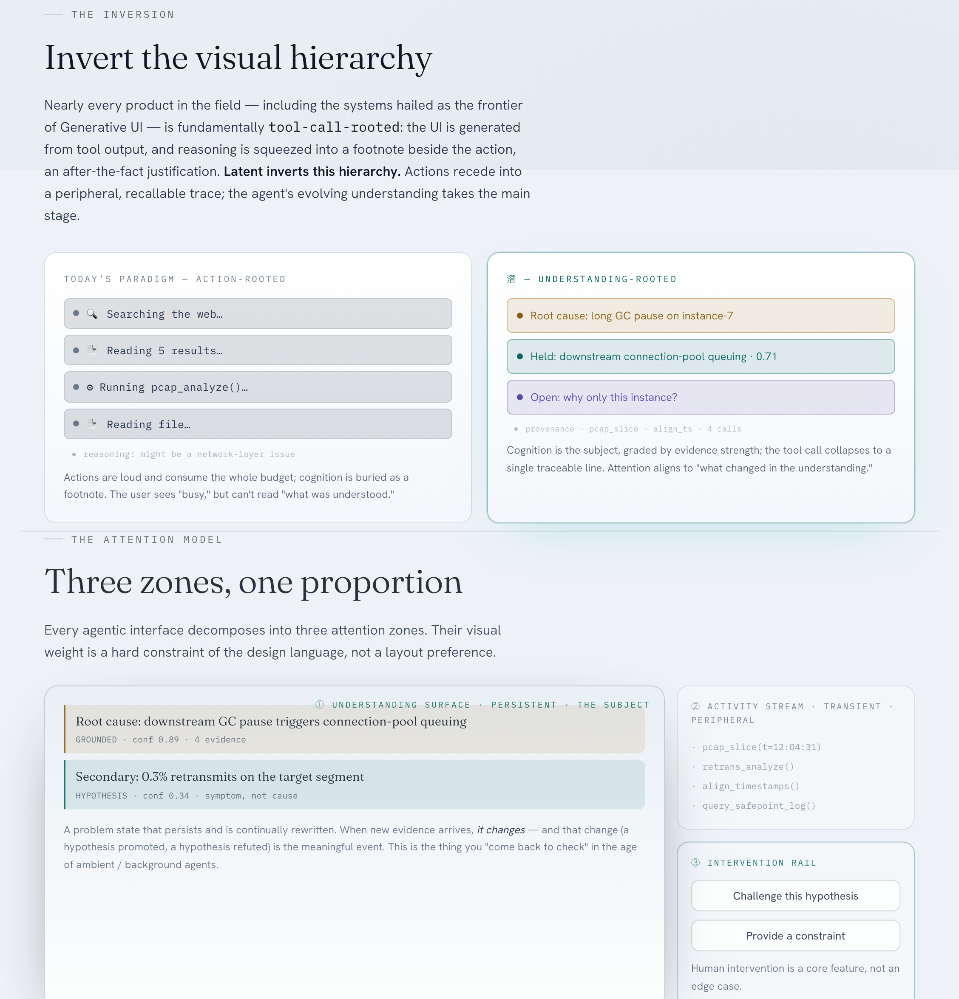

**English** · [中文](README.zh.md)

# Latent · 潜 — An Agentic Design Language

> **Latent is attentioned.** Attention follows understanding, not activity.

Today's agentic interfaces spend their attention rendering tool calls — but a tool call is the *theater* of cognition, not cognition itself. **潛** inverts the visual hierarchy: the agent's continuously evolving, evidence-anchored *understanding* takes the main stage, while actions recede into a peripheral, auditable provenance.

[](https://latent-design.pages.dev)

<p align="center"><a href="https://latent-design.pages.dev"><b>latent-design.pages.dev</b></a> — live site · demos · <a href="https://latent-design.pages.dev/kit/">component kit</a></p>

This repository turns that design language into a **mature deliverable**, built around a single canonical schema as its spine, threaded through four lines of application: product design, model (training) design, agentic-coding guidance, and a pitch site with multi-scenario demos.

## Repository structure

```
packages/tokens/   @latent/tokens     design tokens: color (epistemic state) · type (three voices) · motion (surface/settle/sink/inflection)
packages/react/    @latent/react      ~15 schema-driven React components
schema/            @latent/schema     ★ the spine: Zod CognitiveState contract → generated JSON Schema
validator/         @latent/validator  latent-validate CLI, mechanically enforces the Grounding Contract
site/              Astro pitch site + 5 scenario demos + proportionality band
skills/            latent-design/SKILL.md — the design-language skill for Claude Code
docs/product/      product design spec (designers / PMs)
docs/training/     model training research agenda (hard gate is real; rewards/eval/data are named open problems)
examples/          one validated CognitiveState instance per demo
examples/adapter/  runnable agent-trace → CognitiveState adapter (with docs/MIGRATION.md)
DESIGN_LANGUAGE.html  the original self-demonstrating single page (source of truth for tokens/components/TraceForge)
MISSION.md            strategic overview (thesis, risks, technical program)
```

## The spine: one schema, four consumers

`CognitiveState` (`schema/src/cognitive-state.ts`, v0.2) simultaneously: (a) describes the output the model should emit, (b) types and drives the React components, (c) is checked by the validator, and (d) is referenced by the skill.
The discipline of the Grounding Contract is encoded as **hard constraints** — grounded claims must carry traceable provenance, every hypothesis must carry a falsification, verifiable provenance must carry a re-executable command, and every evidence/provenance reference must resolve — so the validator can **mechanically reject reasoning theater**.

**General, not diagnosis-specific.** Nodes have two orthogonal axes: `state` (the epistemic stance — grounded/hypothesis/open/inflection/refuted, which encodes color) and `kind` (the content role — decision / plan / requirement / option / tradeoff / answer / risk / observation / claim, which encodes the badge label). The same contract therefore holds across every kind of agent: a **decision** or a **requirement understanding** that takes the main stage must equally be grounded, or tentative (with a falsification condition), or honestly open.

**Three themes.** `<html data-theme="dark|light|kami">` switches between dark (deep-sea blue), light (cool paper), and kami (warm parchment + indigo, Kami style). Components reference only semantic tokens; a theme is pure value substitution. Switch it from the top-right of the site, or share via `?theme=`.

## Quick start (bun)

```bash
bun install
bun run gen           # generate cognitive-state.schema.json + tokens.json
bun run validate "examples/**/*.json"   # run the contract checks (all should pass)
bun run dev           # preview the pitch site locally (astro dev)
bun run build         # gen + build the static site to site/dist/
bun run preview       # preview the build output (pure static)
```

Deployment: `site/dist/` is pure static and can be exposed through the staging caddy at `https://<name>.staging.netis.com` (see the `register_staging` skill).

## 6 application demos (agent archetype × latent complexity)

| Demo | Archetype | latent | What to watch |
|---|---|---|---|
| `/demos/traceforge` | Diagnosis / root cause | High | hypotheses → inflection → grounded root cause; verifiable provenance |
| `/demos/planning` | Planning / decision | High | decision / plan / tradeoff / risk roles; constraint-driven |
| `/demos/writing` | Authoring / generation | Mid | requirement anchored to the user's own words; structural decision; stylistic option |
| `/demos/advisory` | Assistant / advice | Mid | answer + explicit assumptions + tradeoff + honest risk |
| `/demos/action` | Agentic action / ambient | High | auditable decisions taken on your behalf; high-risk items pause for your call |
| `/demos/rad-app` | RAD / full-stack app | High | requirement → architecture decision (re-runnable smoke) → plan/option/risk |

## Application layer: App Attention Grammar (macro)

The design language is more than components — the three-zone model scales up to the **whole app**: five attention zones (**① Stage · Understanding · ② Artifact · Activity · Context · ③ Intervene**), with weighting `Stage > Artifact > {Context, Activity}`. The macro inversion: where others put the tool-call stream on the main stage, 潛 puts *understanding* there. `@latent/react/app` provides the zone-role styles; an app lays itself out with `grid-template-areas` and places `<UnderstandingPanel>` in the Stage. Two reference implementations:

| App | Path | What to watch |
|---|---|---|
| 潛 IDE · Vibe Coding | `/apps/vibe-ide` | the sidebar's tool-call stream → the agent's understanding of *what to build*; code centered, terminal recedes |
| 潛 Studio · Image/Video generation | `/apps/gen-studio` | the render queue moves off the main spot → the agent's understanding of creative intent; canvas centered, queue recedes to the side |

## Going further

- Designers / PMs → `docs/product/README.md`
- Migrating an existing agentic UI → `docs/MIGRATION.md` + `examples/adapter/`
- Training / Lab (research agenda) → `docs/training/README.md`
- Writing Latent UI with AI → `skills/latent-design/SKILL.md`
- Philosophy and strategy → `MISSION.md`

v0.1 · 潛龍在淵 · for Netis.
